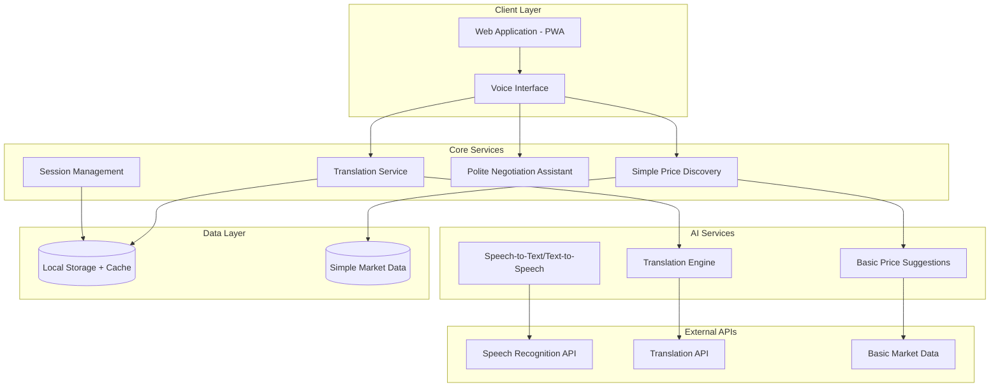

# Design Document: Multilingual Mandi Platform

## Overview

The Multilingual Mandi Platform is a farmer-first, voice-first web application that creates a real-time linguistic bridge for local trade in India. The platform focuses on core features: multilingual voice interaction, simple AI-driven price discovery, polite negotiation assistance, and a hariyali (green paddy-inspired) adaptive UI with no-login-first-use experience.

The system prioritizes usability, inclusion, and real-world adoption for Indian local markets, implementing only the essential features needed for farmers to trade effectively across language barriers.

## Architecture

### High-Level Architecture



### Technology Stack

**Frontend:**
- React.js with TypeScript for the web interface
- Web Speech API for voice recognition and synthesis
- Material-UI with custom hariyali (green) theme
- Progressive Web App (PWA) for mobile optimization
- Local Storage for no-login session management

**Backend Services:**
- Node.js with Express.js for lightweight API services
- Simple REST APIs (no complex microservices)
- In-memory caching for session data

**AI/ML Components:**
- Web Speech API for voice input/output
- Google Translate API for Indian language support
- Simple price suggestion algorithms (no complex ML initially)
- Basic negotiation response templates

**Infrastructure:**
- Single server deployment initially
- Local storage for offline capability
- Simple CDN for static assets

## Components and Interfaces

### 1. Translation Service

**Purpose:** Provides real-time multilingual communication capabilities

**Key Components:**
- `TranslationEngine`: Core translation logic with confidence scoring
- `LanguageDetector`: Automatic language detection for incoming messages
- `ContextPreserver`: Maintains commercial terminology and pricing context
- `TranslationCache`: Redis-based caching for frequently translated phrases

**Interfaces:**
```typescript
interface TranslationService {
  translateMessage(text: string, fromLang: string, toLang: string): Promise<TranslationResult>
  detectLanguage(text: string): Promise<LanguageDetection>
  getConfidenceScore(translation: TranslationResult): number
  cacheTranslation(key: string, translation: TranslationResult): void
}

interface TranslationResult {
  translatedText: string
  confidence: number
  originalText: string
  fromLanguage: string
  toLanguage: string
  preservedTerms: string[]
}
```

### 2. Price Discovery Service

**Purpose:** AI-driven market analysis and price recommendations

**Key Components:**
- `MarketDataAggregator`: Collects data from multiple Indian commodity markets
- `PricePredictionEngine`: ML-based price forecasting and recommendations
- `TrendAnalyzer`: Historical and real-time trend analysis
- `AlertManager`: Price volatility and opportunity alerts

**Interfaces:**
```typescript
interface PriceDiscoveryService {
  getPriceRecommendation(commodity: string, quantity: number, location: string): Promise<PriceRecommendation>
  getMarketTrends(commodity: string, timeframe: string): Promise<MarketTrend[]>
  subscribeToAlerts(vendorId: string, commodities: string[]): void
  updateMarketData(): Promise<void>
}

interface PriceRecommendation {
  commodity: string
  recommendedPrice: number
  priceRange: { min: number, max: number }
  confidence: number
  marketFactors: string[]
  lastUpdated: Date
}
```

### 3. Negotiation Service

**Purpose:** AI-assisted negotiation and deal facilitation

**Key Components:**
- `NegotiationEngine`: Core negotiation logic and state management
- `OfferAnalyzer`: Evaluates offers against market conditions
- `StrategyRecommender`: Suggests negotiation strategies and counter-offers
- `DealTracker`: Monitors negotiation progress and outcomes

**Interfaces:**
```typescript
interface NegotiationService {
  startNegotiation(buyerId: string, sellerId: string, commodity: string): Promise<NegotiationSession>
  analyzeOffer(sessionId: string, offer: Offer): Promise<OfferAnalysis>
  suggestCounterOffer(sessionId: string, currentOffer: Offer): Promise<CounterOfferSuggestion>
  finalizeNegotiation(sessionId: string, agreedTerms: Deal): Promise<CompletedDeal>
}

interface NegotiationSession {
  sessionId: string
  participants: Participant[]
  commodity: string
  currentOffer: Offer | null
  status: 'active' | 'completed' | 'cancelled'
  history: NegotiationEvent[]
}
```

### 4. Vendor Management Service

**Purpose:** User profiles, trust scores, and identity verification

**Key Components:**
- `ProfileManager`: Vendor profile creation and management
- `TrustScoreCalculator`: Calculates and updates trust scores
- `IdentityVerifier`: Government ID and business registration verification
- `TransactionRecorder`: Records completed transactions for trust building

**Interfaces:**
```typescript
interface VendorService {
  createVendorProfile(vendorData: VendorRegistration): Promise<VendorProfile>
  updateTrustScore(vendorId: string, transactionRating: number): Promise<TrustScore>
  verifyIdentity(vendorId: string, documents: IdentityDocument[]): Promise<VerificationResult>
  getVendorProfile(vendorId: string): Promise<VendorProfile>
}

interface VendorProfile {
  vendorId: string
  name: string
  location: string
  specializations: string[]
  trustScore: number
  verificationStatus: 'pending' | 'verified' | 'rejected'
  tradingHistory: TransactionSummary[]
}
```

### 5. Real-time Communication Layer

**Purpose:** WebSocket-based real-time messaging and notifications

**Key Components:**
- `WebSocketManager`: Manages WebSocket connections and routing
- `MessageBroker`: Redis pub/sub for message distribution
- `NotificationService`: Real-time alerts and updates
- `SessionManager`: Manages active trading sessions

**Interfaces:**
```typescript
interface RealtimeService {
  establishConnection(vendorId: string): Promise<WebSocketConnection>
  broadcastMessage(sessionId: string, message: RealtimeMessage): void
  sendNotification(vendorId: string, notification: Notification): void
  subscribeToSession(vendorId: string, sessionId: string): void
}

interface RealtimeMessage {
  type: 'translation' | 'price_update' | 'negotiation' | 'alert'
  sessionId: string
  senderId: string
  content: any
  timestamp: Date
}
```

## Data Models

### Core Entities

```typescript
// Vendor Entity
interface Vendor {
  id: string
  name: string
  email: string
  phone: string
  preferredLanguage: string
  location: {
    state: string
    district: string
    market: string
  }
  businessDetails: {
    registrationNumber?: string
    gstNumber?: string
    businessType: string
  }
  trustScore: number
  verificationStatus: 'pending' | 'verified' | 'rejected'
  createdAt: Date
  updatedAt: Date
}

// Commodity Entity
interface Commodity {
  id: string
  name: string
  category: string
  unit: string
  qualityGrades: string[]
  seasonality: {
    peakMonths: number[]
    offSeasonMonths: number[]
  }
  standardSpecs: Record<string, any>
}

// Market Data Entity
interface MarketData {
  id: string
  commodityId: string
  marketLocation: string
  price: number
  quantity: number
  quality: string
  timestamp: Date
  source: string
  reliability: number
}

// Transaction Entity
interface Transaction {
  id: string
  buyerId: string
  sellerId: string
  commodityId: string
  quantity: number
  agreedPrice: number
  qualitySpecs: Record<string, any>
  negotiationSessionId: string
  status: 'pending' | 'completed' | 'cancelled'
  completedAt?: Date
  ratings: {
    buyerRating?: number
    sellerRating?: number
  }
}

// Translation Cache Entity
interface TranslationCache {
  id: string
  sourceText: string
  translatedText: string
  fromLanguage: string
  toLanguage: string
  confidence: number
  context: 'general' | 'commercial' | 'negotiation'
  usageCount: number
  lastUsed: Date
}
```

### Database Schema Design

**PostgreSQL Tables:**
- `vendors` - Vendor profiles and authentication
- `commodities` - Commodity master data
- `transactions` - Completed trade records
- `trust_scores` - Trust score history and calculations
- `verification_documents` - Identity verification records

**Redis Data Structures:**
- `translation_cache:{lang_pair}` - Hash for cached translations
- `active_sessions:{vendor_id}` - Set of active negotiation sessions
- `price_alerts:{vendor_id}` - List of price alert subscriptions
- `websocket_connections` - Hash mapping vendor IDs to connection IDs

**InfluxDB Measurements:**
- `market_prices` - Time-series price data
- `negotiation_metrics` - Negotiation success rates and timing
- `platform_usage` - User activity and feature usage analytics

## Error Handling

### Error Categories and Strategies

**1. Translation Errors**
- Low confidence translations (< 85%) → Flag for manual review
- API failures → Fallback to cached translations or alternative providers
- Language detection failures → Default to English with user confirmation

**2. Price Discovery Errors**
- Market data unavailability → Use cached data with staleness warnings
- ML model failures → Fallback to historical averages with reduced confidence
- External API timeouts → Graceful degradation with limited functionality

**3. Real-time Communication Errors**
- WebSocket disconnections → Automatic reconnection with exponential backoff
- Message delivery failures → Store and retry with acknowledgment system
- Session state inconsistencies → Synchronization recovery protocols

**4. Data Integrity Errors**
- Transaction conflicts → Optimistic locking with conflict resolution
- Trust score calculation errors → Recalculation with audit trails
- Cache inconsistencies → Cache invalidation and refresh strategies

### Error Response Format

```typescript
interface ErrorResponse {
  error: {
    code: string
    message: string
    details?: any
    timestamp: Date
    requestId: string
  }
  fallback?: {
    available: boolean
    data?: any
    limitations: string[]
  }
}
```

## Testing Strategy

### Dual Testing Approach

The platform will employ both unit testing and property-based testing to ensure comprehensive coverage:

**Unit Tests:**
- Focus on specific examples, edge cases, and error conditions
- Test integration points between microservices
- Validate API contracts and data transformations
- Cover authentication and authorization flows

**Property-Based Tests:**
- Verify universal properties across all inputs using randomized test data
- Validate business rules and invariants
- Test system behavior under various load conditions
- Ensure data consistency across distributed services

**Testing Configuration:**
- Property-based tests will run minimum 100 iterations per test
- Each property test will be tagged with: **Feature: multilingual-mandi-platform, Property {number}: {property_text}**
- Tests will use Jest for unit testing and fast-check for property-based testing
- Integration tests will use Docker Compose for service orchestration

**Test Categories:**
1. **API Contract Tests** - Ensure service interfaces remain stable
2. **Translation Accuracy Tests** - Validate translation quality and context preservation
3. **Price Discovery Tests** - Verify ML model predictions and market data processing
4. **Real-time Communication Tests** - Test WebSocket reliability and message delivery
5. **Security Tests** - Validate authentication, authorization, and data protection
6. **Performance Tests** - Ensure system meets latency and throughput requirements

## Correctness Properties

*A property is a characteristic or behavior that should hold true across all valid executions of a system—essentially, a formal statement about what the system should do. Properties serve as the bridge between human-readable specifications and machine-verifiable correctness guarantees.*

### Property 1: Translation Performance and Quality
*For any* message in a supported Indian language, translation to any other supported language should complete within 2 seconds and preserve commercial terminology with 85% or higher confidence, flagging lower confidence translations for review.
**Validates: Requirements 1.1, 1.2, 1.5**

### Property 2: UI Localization Consistency
*For any* supported language selection, all interface elements should be displayed in that language with proper formatting and cultural context.
**Validates: Requirements 1.4**

### Property 3: Price Discovery Performance and Accuracy
*For any* commodity type, quantity, and vendor location, price recommendations should be generated within 3 seconds and incorporate current market trends, seasonal variations, regional demand, vendor location, commodity quality, and historical data.
**Validates: Requirements 2.1, 2.2, 2.3**

### Property 4: Market Data Freshness
*For any* commodity with active market data, price recommendations should update every 15 minutes, and price displays should refresh within 30 seconds of market data updates.
**Validates: Requirements 2.4, 4.2**

### Property 5: Volatility Alert System
*For any* commodity experiencing market volatility exceeding 10% in an hour, relevant vendors should receive alerts automatically.
**Validates: Requirements 2.5**

### Property 6: Negotiation AI Assistance
*For any* negotiation session, the assistant should analyze both parties' historical patterns, provide real-time counter-offer suggestions based on market conditions, evaluate offers against current rates, and suggest compromise solutions when negotiations stall.
**Validates: Requirements 3.1, 3.2, 3.3, 3.5**

### Property 7: AI Learning and Improvement
*For any* completed negotiation, the system should track patterns and incorporate learnings to improve future suggestions, demonstrating measurable improvement over time.
**Validates: Requirements 3.4**

### Property 8: Market Data Completeness
*For any* commodity search, the platform should display current prices, trends, and demand indicators from real-time market data aggregated from multiple sources.
**Validates: Requirements 4.1, 4.4**

### Property 9: Historical Data Availability
*For any* commodity with sufficient trading history, 30-day historical price charts should be available and accurate.
**Validates: Requirements 4.3**

### Property 10: Trust System Integrity
*For any* completed trade, both parties should be able to rate the transaction, trust scores should be calculated based on transaction history and ratings, and profiles should display trust scores, trading volume, and specializations accurately.
**Validates: Requirements 5.1, 5.2, 5.3**

### Property 11: Identity Verification Process
*For any* vendor registration, identity verification should work correctly with valid government ID and business registration documents.
**Validates: Requirements 5.4**

### Property 12: Trust Score Monitoring
*For any* vendor whose trust score falls below 3.0 out of 5.0, their profile should be automatically flagged for review.
**Validates: Requirements 5.5**

### Property 13: Responsive Design Compatibility
*For any* screen size between 320px and 1920px width, the platform should render correctly with touch-optimized controls on mobile devices.
**Validates: Requirements 6.1, 6.2**

### Property 14: Performance Under Network Constraints
*For any* 3G network connection, the platform should load completely within 5 seconds and support voice input for searches on mobile devices.
**Validates: Requirements 6.3, 6.4**

### Property 15: Offline Functionality
*For any* basic function like viewing saved negotiations and price history, the platform should work without network connectivity.
**Validates: Requirements 6.5**

### Property 16: Transaction Recording Completeness
*For any* completed trade, all transaction details including commodity, quantity, price, and parties should be automatically recorded with complete accuracy.
**Validates: Requirements 7.1**

### Property 17: Analytics and Reporting Generation
*For any* vendor with transaction history, the platform should generate accurate weekly/monthly reports and provide insights on profitable commodities and trading partners while protecting sensitive information.
**Validates: Requirements 7.2, 7.3, 7.5**

### Property 18: Data Retention Compliance
*For any* transaction record, data should be maintained for at least 2 years for audit and analysis purposes.
**Validates: Requirements 7.4**

### Property 19: Security and Encryption Standards
*For any* data transmission and storage, the platform should use TLS 1.3+ for transmission and AES-256 for sensitive data storage, with multi-factor authentication required for all vendor accounts.
**Validates: Requirements 8.1, 8.2, 8.3**

### Property 20: Data Privacy and Deletion
*For any* vendor account deletion request, all personal data should be removed within 30 days while preserving anonymized transaction records, and users should have control over their data sharing preferences in compliance with Indian data protection regulations.
**Validates: Requirements 8.4, 8.5**